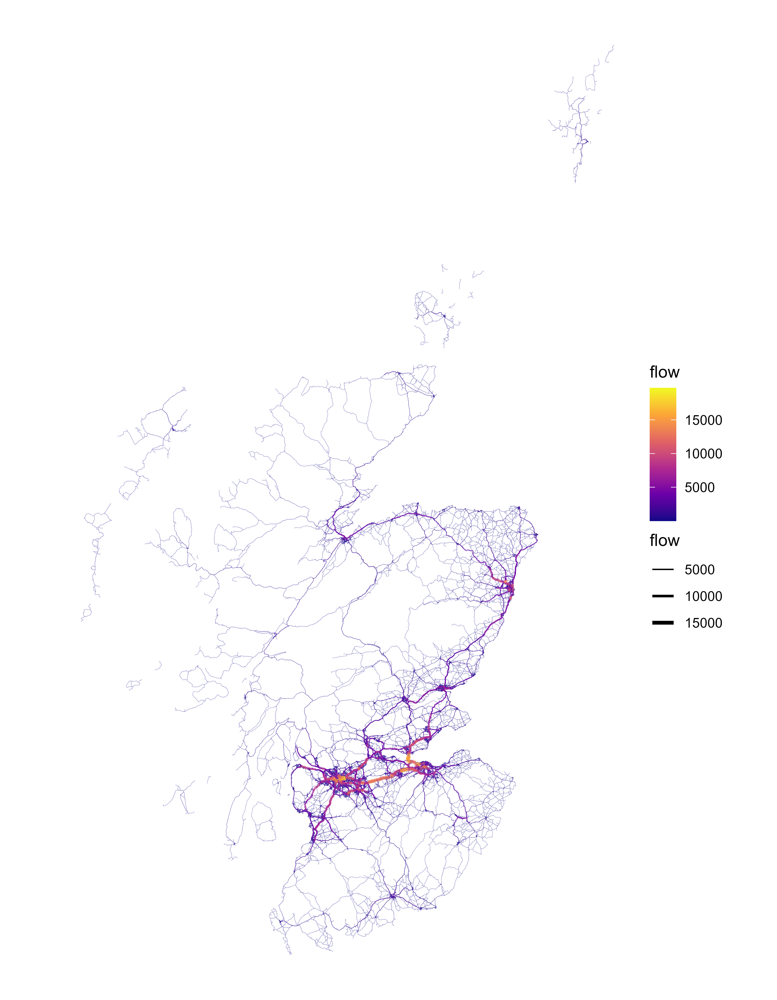

# Traffic assginmnet in Scotland

This is a traffic assignment example in R. It models commuting to work in Scotland.

## Sources

The travel flows are summarised from the Scottish Travel Survey.

It uses OpenStreetMap as input for the network, i.e. https://download.geofabrik.de/europe/great-britain/scotland.html

## References

* cppRouting package: <https://github.com/vlarmet/cppRouting>
* dodgr package: <https://cran.r-project.org/web/packages/dodgr/vignettes/flows.html>
